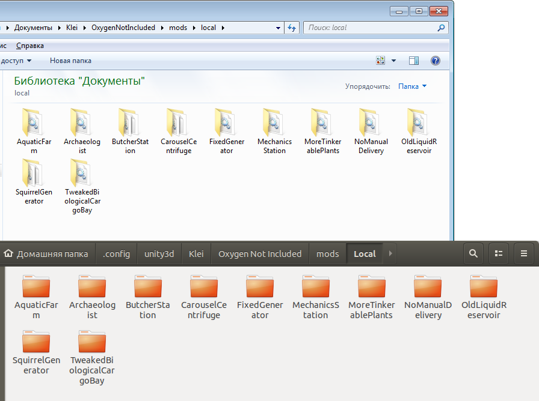

# Sanchozz's mods for Oxygen Not Included
Steam Workshop: https://steamcommunity.com/profiles/76561198341359629/myworkshopfiles/?appid=457140

Last tested on game versions: Vanilla and Spaced Out! DLC **509629**

Limited support for so-called beta versions:  
*Public_Testing* - Do not wait for a quick release of fixes if something breaks.  
*Public_Previous_Update* and *Public_Pre_Mergedown* - Previously working mods should theoretically continue to work, but: there are no new mods, no updates, no new features, no fixes.

# Local Downloads
Steam users: Before trying a local download or reporting an issue, use [PeterHan's Mod Updater](https://steamcommunity.com/sharedfiles/filedetails/?id=2018291283)  to see if the mod is out of date.

Steam sometimes serves outdated mod versions, and Oxygen Not Included is also available on the Epic Games Store. Local copies of these mods are available in the [Releases](https://github.com/SanchozzDeponianin/ONIMods/releases) section, or you can just press `"Code" -> "Download ZIP"`. These mods should be installed into the `Local` folder, creating it if it does not already exist. Mods should remain in their own subfolder.

+ Windows: `%USERPROFILE%\Documents\Klei\OxygenNotIncluded\mods\local` Replace the documents path with the path to your Documents folder if this folder has been redirected.
+ Mac OS: `/Users/user name/Library/Application Support/unity.Klei.Oxygen Not Included/mods/Local` Replace user name with your user name.
+ Linux: `~/.config/unity3d/Klei/Oxygen Not Included/mods/Local`

Note, the `Local` folder name is case-sensitive on Mac OS and Linux.

**Do not use a Steam copy and a local copy of the same mod at the same time.** Disable the Steam version in the mods list before activating any local copies.

# Mod List
## New Features
|  **Name**  |  **Description**  |  **Vanilla**  |  **Spaced Out! DLC**  |
| :--------: | :---------------: | :-----------: | :-------------------: |
| [Aquatic Farm](https://steamcommunity.com/sharedfiles/filedetails/?id=1910961538) | Adds a new Aquatic Farm tile that can absorbs Liquids from the world for irrigation. Does not require Liquid Piping. | Yes | Yes |
| [Buildable Neural Vacillator](https://steamcommunity.com/sharedfiles/filedetails/?id=2715752713) | Allows you to build your own Neural Vacillator | Yes | Yes |
| [Butcher & Fishing Stations](https://steamcommunity.com/sharedfiles/filedetails/?id=1907824546) | Adds a new Stations allows the Ranchers to control the population and butchering too old, surplus, or unwanted Critters. | Yes | Yes |
| [Carousel](https://steamcommunity.com/sharedfiles/filedetails/?id=1899088142) | Adds a new recreation building. Funny dizzy entertainment. Sometimes too dizzy... | Yes | Yes |
| [Crabs Profit](https://steamcommunity.com/sharedfiles/filedetails/?id=2816177874) | Adds a little Crab Meat to all types of Crabs, as well as a shell for Sanishell, which can be crushed to obtain Metal Ore. | Yes | Yes |
| [Insulated Radbolt Joint Plate](https://steamcommunity.com/sharedfiles/filedetails/?id=2451195132) | Adds a Insulated variant of Radbolt Joint Plate.| No | Yes |
| [Mechanics Station](https://steamcommunity.com/sharedfiles/filedetails/?id=1938117526) | Adds a new Mechanics Station, with which engineers could improve the performance of various buildings. | Yes | Yes |
| [Rover's Recharger](https://steamcommunity.com/sharedfiles/filedetails/?id=2761462871) | Allows the Rover to charge its chemical battery with chemical fuel. | No | Yes |
| [Smelter](https://steamcommunity.com/sharedfiles/filedetails/?id=2350553957) | Adds a new Smelter building designed to smelt metals in the early game, and a few new recipes. | Yes | Yes |
| [Squirrel Wheel](https://steamcommunity.com/sharedfiles/filedetails/?id=2086704949) | Adds a new Squirrel Wheel building that your Pips can use to running, and you will get a small profit of bonus electricity power. | Yes | Yes |
| [Suit Recharger](https://steamcommunity.com/sharedfiles/filedetails/?id=2688074001) | Allows Duplicants to recharge all kinds of their Suits and Oxygen Masks without taking them off. | Yes | Yes |

## Tweaks
|  **Name**  |  **Description**  |  **Vanilla**  |  **Spaced Out! DLC**  |
| :--------: | :---------------: | :-----------: | :-------------------: |
| [Artifacts in Care Packages](https://steamcommunity.com/sharedfiles/filedetails/?id=2455735197) | Allows to get Artifacts in Care Packages | Yes | Yes
| [Better Farming Effects and Tweaks](https://steamcommunity.com/sharedfiles/filedetails/?id=2778941969) | Provides a number of improvements for how your Farmers, Worms and Beetles take care of plants, including seed propagation of non-yielding plants | Yes | Yes |
| [Eat every day](https://steamcommunity.com/sharedfiles/filedetails/?id=2573532147) | It forces duplicants to eat every day, even at the "no sweat" difficulty level, which guarantees a stable morale bonus. | Yes | Yes |
| [Enclosed Telescope Tune-Up](https://steamcommunity.com/sharedfiles/filedetails/?id=2630438094) | Tuning of a Enclosed Telescope: increased the radius and scanning speed, adjusted requirements, some improvements and bug fixes. | No | Yes |
| [Hydrocactus](https://steamcommunity.com/sharedfiles/filedetails/?id=2794198686) | Allows you to obtain a half-forgotten plant Hydrocactus in an normal fair game | No | Yes |
| [No Manual Delivery](https://steamcommunity.com/sharedfiles/filedetails/?id=2047308624) | Adds a "Allow Manual Use" checkbox for very many buildings to efficiently use the conveyor system and prevent duplicantes from manually delivering resources to those buildings. | Yes | Yes |
| [Oil Well BugFix](https://steamcommunity.com/sharedfiles/filedetails/?id=2558650241) | Fixes a bug, when sometimes the Duplicants get stuck trying to depressurize the Oil Well if it is turned off by automation or out of water or does not work for another reason. | Yes | Yes |
| [[Visual] Old Liquid Reservoir](https://steamcommunity.com/sharedfiles/filedetails/?id=1904543022) | Returns the old visual art of the Liquid Reservoir from older "early access" versions of the game. | Yes | Yes |
| [Rebuildable AETN](https://steamcommunity.com/sharedfiles/filedetails/?id=2539984678) | Allows to disassemble and build AETN in another place | Yes | Yes |
| [Relic Hunter](https://steamcommunity.com/sharedfiles/filedetails/?id=1927259233) | Unlocks the Relic Hunter trait that exists in vanilla but is not used. A duplicant with this trait almost always finds Artifacts when traveling to other planets. | Yes | No |
| [Sandbox: Mutant Plants](https://steamcommunity.com/sharedfiles/filedetails/?id=2493249462) | Allows to quickly receive mutant Seeds and Plants in the Sandbox mode | No | Yes |
| [Tweaked Biological Cargo Bay](https://steamcommunity.com/sharedfiles/filedetails/?id=1891479671) | Allows Duplicants independently transport animals directly from the Biological Cargo Bay to the Critter Drop-Off, without performing any unnecessary intermediate actions. | Yes | No |
| [Varicoloured Balloons](https://steamcommunity.com/sharedfiles/filedetails/?id=2293939893) | Adds more different colors and variations of balloons. | Yes | Yes 
| [Where's My Loot?](https://steamcommunity.com/sharedfiles/filedetails/?id=2670041100) | Allows you to get the expected loot from objects that have not been inspected but have been demolished. | Yes | Yes |
| [Worn Suit doesn't drop Canister](https://steamcommunity.com/sharedfiles/filedetails/?id=2679005270) | Discharges Worn Suits when unequipping so they don't drop the Canisters. Oxygen and Kerosene are returned to the Suit Dock for later reuse. | Yes | Yes |
<!--|  |  | No | Yes | -->

# Special thanks to
- [@pardeike](https://github.com/pardeike), creator of [Harmony](https://github.com/pardeike/Harmony), the library that made oni modding possible.
- [@PeterHan](https://github.com/peterhaneve), author of [PLib](https://github.com/peterhaneve/ONIMods/tree/master/PLib).
